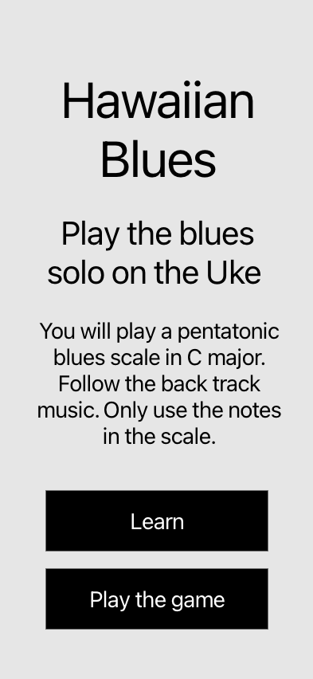

# Game Hawaiian Blues

## Planning
### 1. Game idea

The main idea is to play a pentatonic Blues solo over a background music. 

When starting the came the player is presented with a simplified Ukulele fretboard where each string position translates into note. All positions can be played but only a few of the positions are part of the pentatonic scale. The first iteration will consists of a 12 bar blues as background music, the key of the background music will most probably be C Major. According to the key of the background music the pentatonic scale notes change. 

The challenge of the game will be to only play the correct pentatonic notes for the selected key of the background music. If the player plays a note outside the scale the player will lose points. There will also be a maximum time between played notes so that the blues solo becomes ongoing.

### 2. Game design
The main object in the game area will be the ukulele fretboard matrix where each position translates into a note. The fretboard has to be configured in an object array where the position, the corresponding note and the sound is stored. When starting the game the key is selected,  in the first version there will be only one option, key C Major but the design will allow adding more keys later. The fretboard size will be limited to more or less 6-7 bars to make it fit well into the screen. 

The correct notes for a pentatonic scale in key C Major has to be configured and stored to be able to verify if the note played is within the right pentatonic scale or not. 

Ideally this should be played on a mobile device using touch interactions. But it should also be allowed to use a mouse, playing the notes by clicks.

**An example of a game timeline**
- The player starts the game and selects the key, in this example C Major
- The fretboard is displayed showing the possible positions in the current key. It is possible to play the notes in this stage for testing, learning. When the player has studied the positions he clicks next.
- The background music starts and the player has to start to play the blues solo playing the correct notes. The player needs to play a note at least every 3 seconds. The player will get a saldo of 10 points starting the game.
- The background music is looping a 12 bar blues, for each loop without wrong notes or missing the 3 second limit the player will be notified and get an amount of points.
- Errors like playing the wrong note or missing the time line will result in minus points. 
- The player will loose the game if the points saldo reaches 0. 
- The player will win the gami if the points saldo reaches 100.

**First lo fi wireframes of start screen and game screen**




### Programming lanuges used
HTML, CSS, and JavaScript. The JavaScript will be developed using classes and OOP

### 3. To-dos

To-dos are managed in Trello but the below list will give an overview of the steps included in the process.

1. Lo fi wireframe of the game
2. Set up the html, css and js structure
3. Define the game area and the fret board (ukulele area) using relative sizing
4. Create the needed data files, arrays with objects
4. Set up the fretboard from the array (Class FretBoard) and add evenListeners
5. Get the valid positions from the pentatonic scale (Class PentatonicScale)
6. Set up the logic for the the played notes mathing the valid pentatonic scale. 

### 4. OOP Organisation
#### Classes
**BluesGame**
This is the game object that holds the general game properties like points, selected Key etc.
**FretBoard**
```javascript
[
{note: "C", positionY: 1, positionX: 1, sound: "src for sound"},
{etc.}
]
```
**PentatonicScale**
Including static object
```javascript
{
    "C": ["C", "D", "E", "G", "A"]
}
```
**ScoreBoard**
**Message**


### 5. Start Coding

## Description

## Development Phases

## Backlog